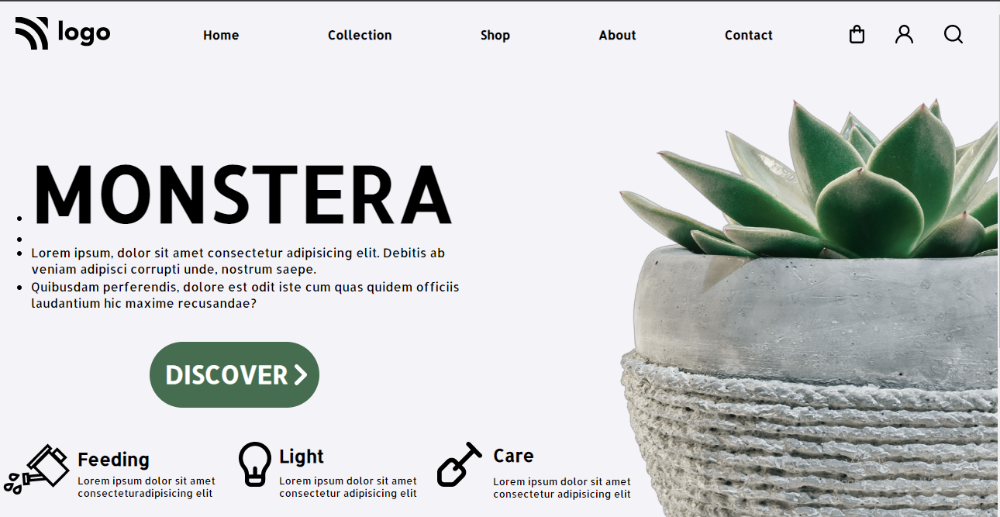

# Mukul Basu

## Project

## Important Things learnt 
1. Aligning items in a navigation bar that are not under ordered / unordered lists.
2. bordering designs

## Honest Time to finish this project

Took around **6 hrs**
Figuring out the way to align the header items in the navigation menu that are not listed items was a tough one.

## Focus Learning
- alignment
- border design
- background design

## Live link

[Project Link]([https://liveproject6.com](https://vermillion-cucurucho-fa9219.netlify.app/) "Netlify")

